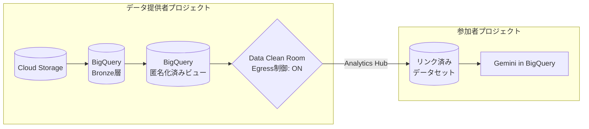
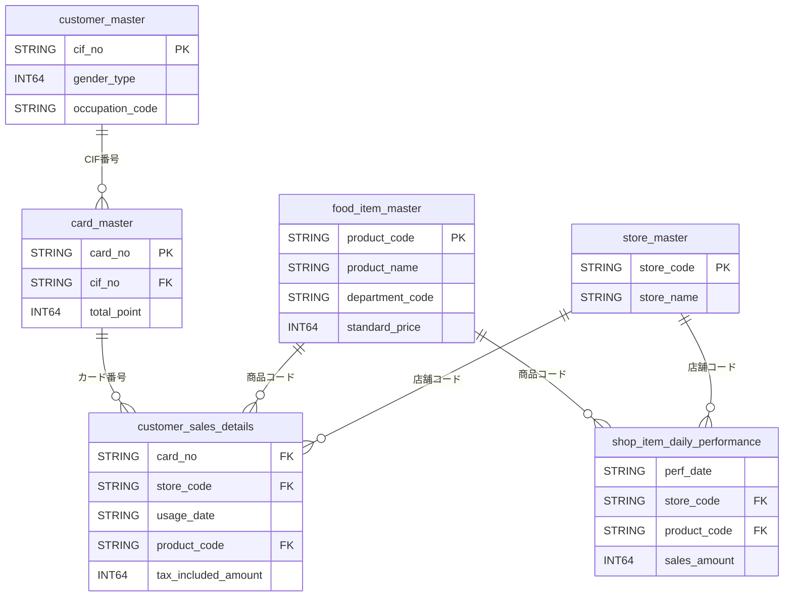

# データで考える、沖縄の「ちょうどいい」と「もっといい」

**Jagu'e'r 沖縄分科会 × サンエー × 琉球大学 特別コラボハンズオン**

[](https://jaguer.connpass.com/event/386873/)

---

## イベント概要

| 項目 | 内容 |
|------|------|
| 日時 | 2026年4月11日（土）10:00〜15:00 |
| 場所 | 琉球大学 工学部 |
| 主催 | [Jagu'e'r](https://jaguer.jp/)（Google Cloud ユーザー会）沖縄分科会 |
| 協力 | 株式会社サンエー、琉球大学 |

サンエー様の実 PoS データ（匿名化済み）を使い、Google Cloud の BigQuery・Gemini を活用したデータ分析を体験するワークショップです。

## アーキテクチャ



### セキュリティ（多層防御）

1. **アクセス制御** — IAM + Analytics Hub サブスクライバー制限
2. **事前匿名化** — 個人情報の SHA-256 ハッシュ化、原価除外
3. **承認済みビュー** — 機密カラムをビューから除外、店舗コードを店舗名に変換
4. **Egress 制御** — データのダウンロード・コピー・エクスポートをブロック

## リポジトリ構成

```
.
├── docs/
│   ├── handson/                             # ハンズオン参加者向けドキュメント
│   │   ├── participant-setup-guide.md         # 参加者向けセットアップガイド
│   │   └── コンテンツ案.md                     # ハンズオンコンテンツ案
│   └── infrastructure/                      # インフラ設計ドキュメント
│       ├── dcr-architecture-overview.md        # DCR アーキテクチャ概要
│       └── card-no-anonymization-plan.md       # カード番号匿名化計画
├── site/                                    # 静的サイト（GitHub Pages）
└── .github/workflows/                       # CI/CD
```

## データモデル



## ハンズオンの流れ

| 時間 | 内容 |
|------|------|
| 10:00-10:15 | オープニング・データクリーンルームの解説 |
| 10:15-10:30 | **Step 1**: 環境セットアップ & データ確認 |
| 10:30-11:00 | **Step 2**: AI に聞いてみよう（Gemini in BigQuery） |
| 11:00-11:30 | **Step 3**: データの謎解き分析 |
| 11:30-11:50 | **Step 4**: 発展コンテンツ（自由分析 / データ基盤ディスカッション） |
| 11:50-12:00 | クロージング |
| 12:00- | BBQ 交流会（希望者） |

## 環境セットアップ

参加者の方は [参加者向けセットアップガイド](docs/handson/participant-setup-guide.md) を参照してください。

## 関連リンク

- [connpass イベントページ](https://jaguer.connpass.com/event/386873/)
- [Jagu'e'r 沖縄分科会](https://jaguer.connpass.com/)
- [BigQuery Data Clean Rooms](https://cloud.google.com/bigquery/docs/data-clean-rooms)
