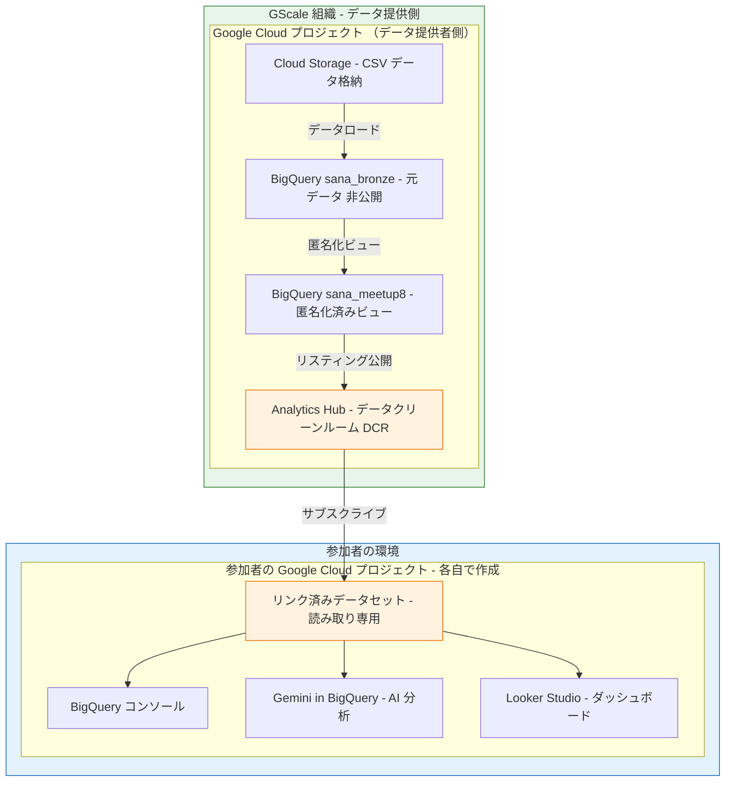
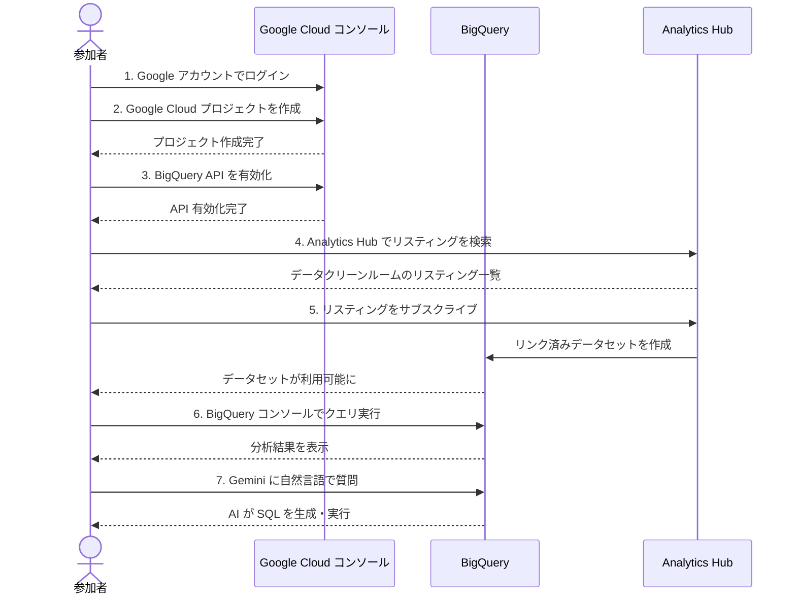
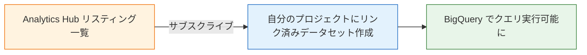
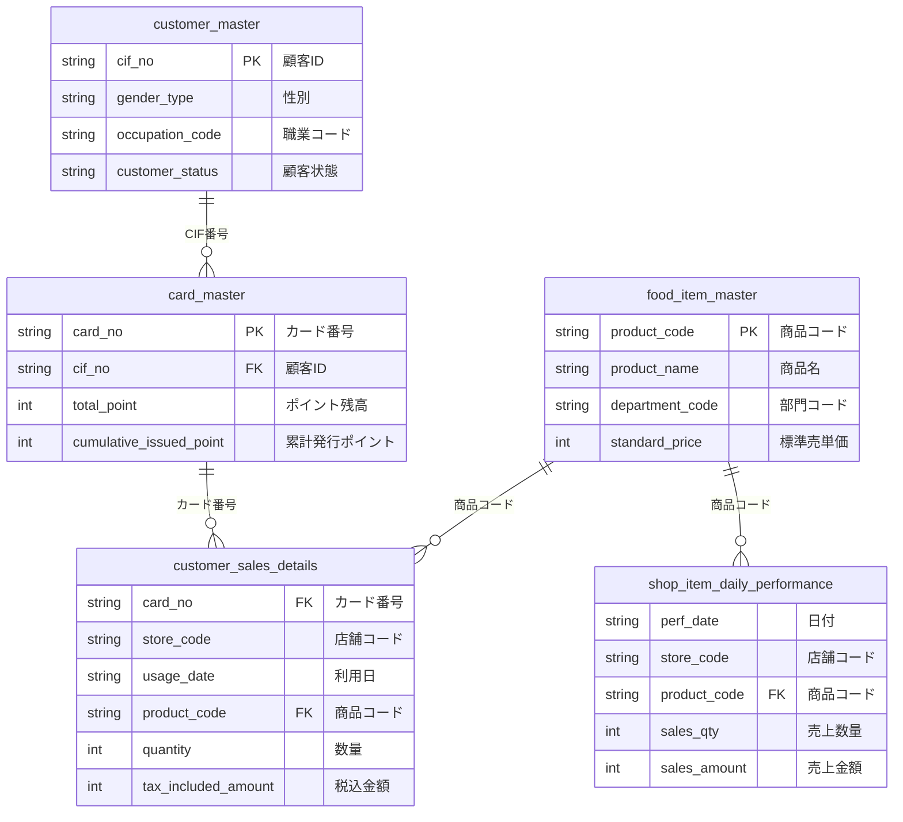

# ハンズオン参加者向け 環境セットアップガイド

## はじめに

このガイドでは、ハンズオンで使用する Google Cloud 環境のセットアップ手順を説明します。
Google Cloud が初めての方でも、手順通りに進めれば 15 分程度で完了します。

### ハンズオンで体験すること

- 沖縄のスーパーマーケット「サンエー」の **実際の PoS データ** を分析
- **Gemini（AI）** に自然言語で質問するだけでデータから答えが返ってくる体験
- **BigQuery** で SQL クエリを実行し、売上データの謎を解く
- **Looker Studio** でダッシュボードを作成

---

## システム構成図



### ポイント

- **データはコピーされません** — リンク済みデータセットは GScale 側のデータを参照するだけです
- **Egress 制御** により、データのダウンロード・エクスポートは技術的に防止されています
- 参加者は **自分のプロジェクト内** で BigQuery クエリや Gemini を使って分析します

---

## セットアップの全体フロー



---

## Step 1: Google アカウントの準備

Google Cloud を利用するには **Google アカウント** が必要です。

- **Gmail アカウント** をお持ちの方 → そのまま使えます
- **大学のメールアドレス** が Google Workspace の場合 → そのまま使えます
- **Google アカウントをお持ちでない方** → [accounts.google.com](https://accounts.google.com) で無料作成できます

---

## Step 2: Google Cloud プロジェクトの作成

### 2-1. Google Cloud コンソールにアクセス

1. ブラウザで **[console.cloud.google.com](https://console.cloud.google.com)** を開く
2. Google アカウントでログインする
3. 初めてアクセスする場合、利用規約への同意が求められます → **同意して続行**

### 2-2. プロジェクトを作成

1. 画面上部の **プロジェクト選択ボタン**（「プロジェクトの選択」または既存プロジェクト名が表示されている箇所）をクリック

   ```
   ┌──────────────────────────────────────────────┐
   │ ☁ Google Cloud    [▼ プロジェクトの選択]      │
   └──────────────────────────────────────────────┘
                            ↑ ここをクリック
   ```

2. 表示されるダイアログの右上にある **「新しいプロジェクト」** をクリック

3. 以下の情報を入力:

   | 項目 | 入力内容 |
   |------|---------|
   | **プロジェクト名** | `handson-XXXX`（XXXX は自分の名前のローマ字など、好きな名前） |
   | **場所** | 「組織なし」のままでOK |

4. **「作成」** ボタンをクリック

5. 作成完了の通知が表示されたら、**通知内の「プロジェクトを選択」** をクリックして作成したプロジェクトに切り替え

> **注意**: プロジェクト ID は世界で一意である必要があります。「このプロジェクト ID は既に使用されています」と表示された場合は、別の名前を試してください。

### 2-3. 課金（Billing）の設定

BigQuery でクエリを実行するには、課金アカウントの設定が必要です。

#### バウチャーをお持ちの方（ハンズオン当日配布）

1. 配布されたバウチャーコードを手元に用意
2. ブラウザで **[cloud.google.com/billing/coupon](https://cloud.google.com/billing/coupon)** を開く
3. バウチャーコードを入力して **「同意して続行」** をクリック
4. 課金アカウントが自動作成されます
5. 左上のメニュー（≡）→ **「お支払い」** → 作成したプロジェクトがリンクされていることを確認

#### 無料トライアルを利用する方

1. Google Cloud コンソールの上部に表示される **「無料で利用開始」** バナーをクリック
2. 画面の指示に従い、クレジットカード情報を登録（無料トライアル期間中は課金されません）
3. $300 分の無料クレジットが付与されます（今回のハンズオンでは数十円程度しか使いません）

> **安心ポイント**: BigQuery には月 1TB まで無料のクエリ枠があり、今回のハンズオン（数千件のデータ）では課金が発生するレベルに達しません。

---

## Step 3: BigQuery API の有効化

1. Google Cloud コンソールの画面上部にある **検索バー** に `BigQuery API` と入力

   ```
   ┌──────────────────────────────────────────────┐
   │ ☁ Google Cloud    🔍 BigQuery API            │
   └──────────────────────────────────────────────┘
   ```

2. 検索結果から **「BigQuery API」** を選択
3. **「有効にする」** ボタンをクリック
4. 有効化完了まで数秒待つ

> **確認**: 既に有効になっている場合は「API が有効です」と表示されます。その場合は次のステップへ進んでください。

---

## Step 4: Analytics Hub でデータをサブスクライブ

ここが最も重要なステップです。GScale が提供するデータクリーンルームのデータを、自分のプロジェクトから参照できるようにします。



### 4-1. Analytics Hub を開く

1. Google Cloud コンソールの左メニュー（≡）→ **「Analytics Hub」** をクリック
   - 見つからない場合は検索バーに `Analytics Hub` と入力
2. Analytics Hub のトップページが表示されます

### 4-2. リスティングを検索

1. **「検索」** タブをクリック
2. 検索ボックスに **`サンエー`** または **`sana`** と入力して検索
3. 以下のリスティングが表示されます:

   | リスティング名 | 内容 |
   |--------------|------|
   | card_master - カードマスター | ポイントカード情報（匿名化済み） |
   | customer_master - 顧客マスター | 顧客属性情報（個人情報除外済み） |
   | customer_sales_details - 売上明細 | 購買トランザクション（原価除外済み） |
   | shop_item_daily_performance - 店別日別実績 | 店舗 × 商品 × 日の実績データ |
   | food_item_master - 商品マスター | 食品商品情報（原価除外済み） |

### 4-3. リスティングをサブスクライブ

**各リスティングに対して、以下の手順を繰り返します。**

1. リスティング名をクリックして詳細ページを開く
2. **「サブスクライブ」** ボタンをクリック
3. 設定画面で以下を入力:

   | 項目 | 入力内容 |
   |------|---------|
   | **プロジェクト** | Step 2 で作成した自分のプロジェクト |
   | **データセット名** | `meetup8`（最初の1つ目だけ入力。2つ目以降は同じデータセットを選択） |
   | **ロケーション** | `asia-northeast1`（東京）— 自動選択される場合はそのまま |

4. **「サブスクライブ」** をクリック

> **重要**: 2 つ目以降のリスティングをサブスクライブする際は、「既存のデータセットを使用」を選択し、最初に作成した `meetup8` を指定してください。これにより、全テーブルが 1 つのデータセットにまとまります。

### 4-4. サブスクライブの確認

全5つのリスティングをサブスクライブしたら、正しくデータが見えるか確認します。

1. 左メニュー（≡）→ **「BigQuery」** をクリック
2. 左側のエクスプローラーパネルで、自分のプロジェクト → `meetup8` データセットを展開
3. 以下の 5 つのテーブル（ビュー）が表示されていれば成功です:

   ```
   📁 自分のプロジェクト
   └── 📁 meetup8
       ├── 📊 card_master
       ├── 📊 customer_master
       ├── 📊 customer_sales_details
       ├── 📊 food_item_master
       └── 📊 shop_item_daily_performance
   ```

---

## Step 5: 動作確認 — 最初のクエリを実行

1. BigQuery コンソールの **「クエリを新規作成」**（+ ボタン）をクリック
2. 以下の SQL を入力:

   ```sql
   -- まずは売上明細を見てみよう（最初の10件）
   SELECT * FROM `meetup8.customer_sales_details` LIMIT 10;
   ```

3. **「実行」** ボタンをクリック（または `Ctrl + Enter` / `Cmd + Enter`）
4. 画面下部に結果が表示されれば成功です

### 件数を確認

```sql
-- 全テーブルの件数を確認
SELECT 'card_master' AS table_name, COUNT(*) AS row_count FROM `meetup8.card_master`
UNION ALL
SELECT 'customer_master', COUNT(*) FROM `meetup8.customer_master`
UNION ALL
SELECT 'customer_sales_details', COUNT(*) FROM `meetup8.customer_sales_details`
UNION ALL
SELECT 'food_item_master', COUNT(*) FROM `meetup8.food_item_master`
UNION ALL
SELECT 'shop_item_daily_performance', COUNT(*) FROM `meetup8.shop_item_daily_performance`;
```

期待される結果:

| table_name | row_count |
|-----------|-----------|
| card_master | 100 |
| customer_master | 100 |
| customer_sales_details | 3,059 |
| food_item_master | 16 |
| shop_item_daily_performance | 100 |

---

## Step 6: Gemini in BigQuery を有効化

AI にデータについて自然言語で質問するために、Gemini を有効化します。

1. BigQuery コンソール右上の **Gemini アイコン**（✨ マーク）をクリック
2. 「Gemini を有効にしますか？」と聞かれた場合は **「有効にする」** をクリック
3. チャット入力欄が表示されたら、試しに以下を入力:

   ```
   このデータの中で一番高い買い物はいくらでしたか？
   ```

4. Gemini が SQL を自動生成し、結果を返してくれます

> **うまくいかない場合**: Gemini が `meetup8` データセットを認識しない場合は、左パネルで `meetup8` データセットをクリックして選択した状態で再度質問してみてください。

---

## よくあるトラブルと対処法

### Q. 「課金アカウントが設定されていません」と表示される

→ Step 2-3 の課金設定が完了していません。バウチャーコードの入力、または無料トライアルの登録を行ってください。

### Q. Analytics Hub でリスティングが見つからない

→ 以下を確認してください:
1. 検索キーワードが正しいか（`サンエー` または `sana`）
2. ハンズオン用 Google アカウントでログインしているか
3. それでも見つからない場合は、運営スタッフにお声がけください

### Q. サブスクライブ時に「権限がありません」と表示される

→ 以下を確認してください:
1. 自分のプロジェクトが選択されているか（GScale のプロジェクトではなく）
2. 課金アカウントがプロジェクトにリンクされているか
3. BigQuery API が有効化されているか

### Q. クエリ実行時に「アクセスが拒否されました」と表示される

→ サブスクライブが正しく完了していない可能性があります。Step 4 を再度確認してください。

### Q. データをダウンロードしようとしたらブロックされた

→ 正常な動作です。データクリーンルームの Egress 制御により、データのダウンロード・エクスポートは意図的に防止されています。分析結果は画面上で確認してください。

### Q. プロジェクト ID が「既に使用されています」と表示される

→ プロジェクト ID は世界中で一意です。`handson-` の後に自分の名前や日付を追加して、ユニークな名前にしてください。
例: `handson-tanaka-0315`, `handson-ryudai-2026`

---

## データの概要（参考）



### テーブル一覧

| テーブル名 | 内容 | 件数 | 主な分析用途 |
|-----------|------|------|------------|
| `customer_master` | 顧客属性 | 100 件 | 性別・職業別の購買傾向分析 |
| `card_master` | ポイントカード | 100 件 | ポイント利用状況分析 |
| `customer_sales_details` | 売上明細 | 3,059 件 | **メイン分析対象** — 日別・店舗別・商品別の売上分析 |
| `food_item_master` | 商品マスター | 16 件 | 商品情報の参照 |
| `shop_item_daily_performance` | 店別日別実績 | 100 件 | 店舗パフォーマンス分析 |

---

## セットアップ完了チェックリスト

以下がすべて完了していれば、ハンズオンの準備は万全です。

- [ ] Google アカウントでログインした
- [ ] Google Cloud プロジェクトを作成した
- [ ] 課金アカウントを設定した（バウチャーまたは無料トライアル）
- [ ] BigQuery API を有効化した
- [ ] Analytics Hub で 5 つのリスティングをサブスクライブした
- [ ] `meetup8` データセットに 5 つのテーブルが表示されている
- [ ] テストクエリ（`SELECT * ... LIMIT 10`）が正常に実行できた
- [ ] Gemini in BigQuery が有効になっている

**すべて完了したら、ハンズオン本編に進みましょう！**
