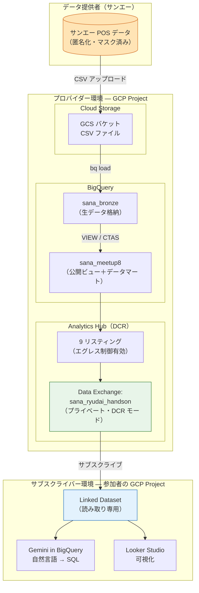
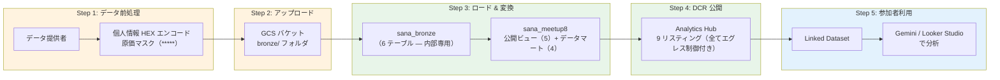
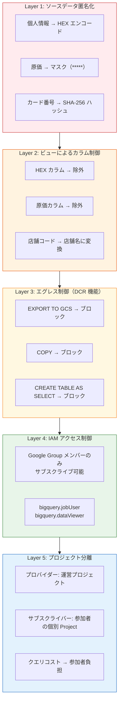
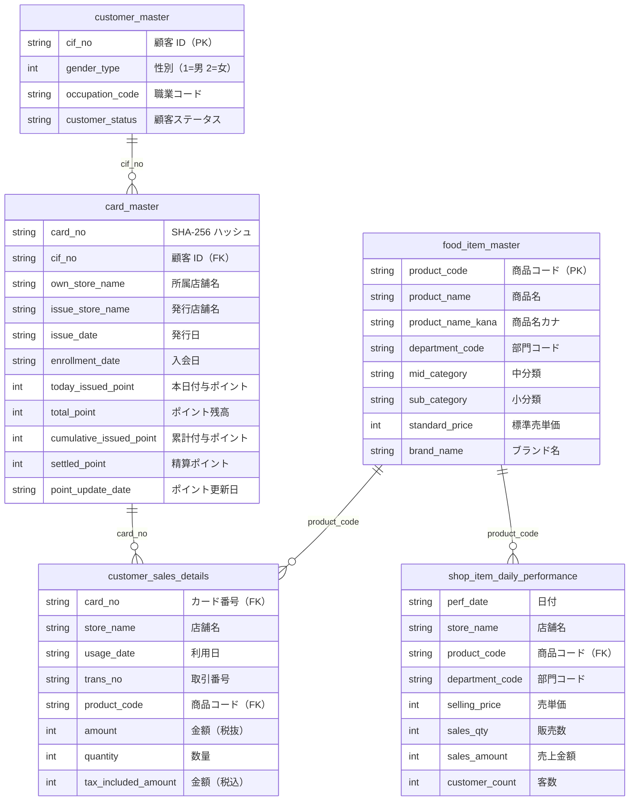
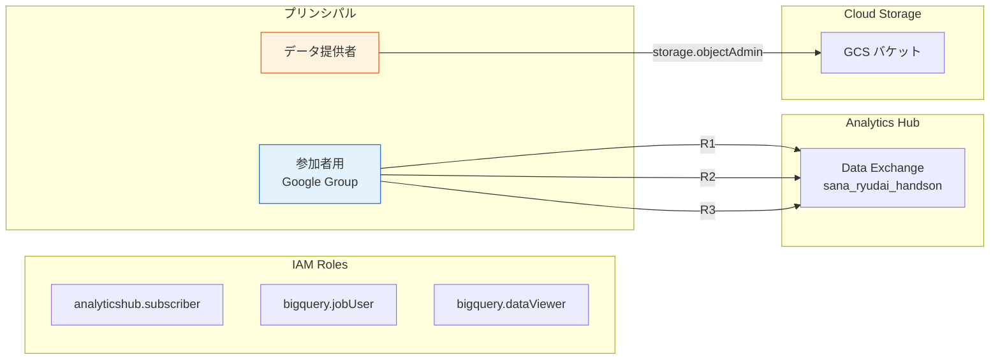
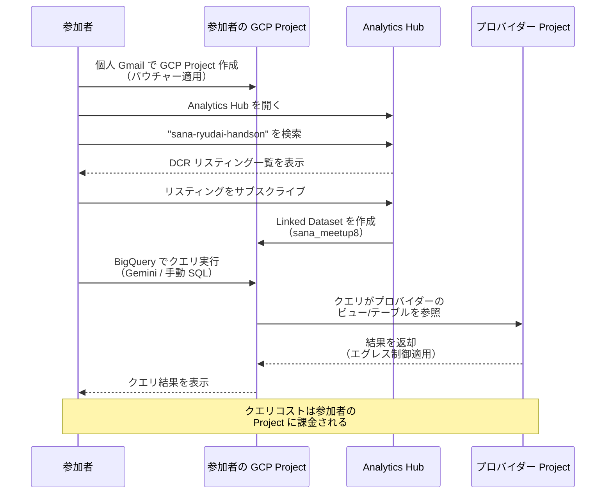

# データクリーンルーム（DCR）アーキテクチャ概要

> **イベント**: データで考える、沖縄の「ちょうどいい」と「もっといい」
> **主催**: Jagu'e'r 沖縄支部 × サンエー × 琉球大学
> **開催日**: 2026-04-11

---

## 1. 全体アーキテクチャ

---

## 2. データフロー

---

## 3. セキュリティ多層防御

---

## 4. データセット構成

### 4.1 Bronze 層（`sana_bronze`）— 内部専用・参加者には非公開

生データを格納するテーブル群。個人情報（HEX エンコード済み）や原価（マスク済み）を含むため、参加者には直接公開しない。

| テーブル | 説明 | カラム数 | 備考 | 公開ビューとの対応 |
|:---|:---|:---:|:---|:---|
| `store_master` | 店舗マスター | 2 | store_code → store_name マッピング | **ビューなし**（各ビュー内で店舗名変換に内部利用） |
| `card_master` | カードマスター | 21 | ポイントカード情報 | → 公開ビュー `card_master` |
| `customer_master` | 顧客マスター | 21 | 個人情報は HEX エンコード済み | → 公開ビュー `customer_master` |
| `customer_sales_details` | 売上明細 | 15 | cost_price はマスク済み | → 公開ビュー `customer_sales_details` |
| `food_item_master` | 食品マスター | 147 | 日本語カラム名（CSV 自動検出） | → 公開ビュー `food_item_master` |
| `shop_item_daily_performance` | 店別日別実績 | 35 | cost_price はマスク済み | → 公開ビュー `shop_item_daily_performance` |

> **ポイント**: Bronze 層は 6 テーブルだが、`store_master` は各ビュー内部で店舗コード→店舗名の変換に使用するのみで、単独の公開ビューとしては提供しない。そのため公開ビューは **5 つ**になる。

### 4.2 公開ビュー（`sana_meetup8`）— 参加者に公開（5 ビュー）

Bronze 層のテーブルから、個人情報カラム（HEX エンコード済みの氏名・生年月日・住所・電話番号）と原価カラムを除外し、店舗コードを店舗名に変換した安全なビュー。

### 4.3 データマート（`sana_meetup8`）— 参加者に公開（4 マート）

公開ビューから集計・加工した分析用の実体テーブル（`CREATE TABLE AS SELECT` で作成）。ビューと異なりマテリアライズ済みのため、参加者のクエリパフォーマンスが向上する。

| マート | 集計粒度 | 主要指標 |
|:---|:---|:---|
| `mart_daily_sales` | 日別 × 店舗別 | 取引数、売上合計、ユニーク顧客数 |
| `mart_customer_summary` | カード番号別 | 来店日数、購入回数、合計金額、平均単価 |
| `mart_product_ranking` | 商品コード別 | 販売数量、売上金額、購入者数 |
| `mart_basket_analysis` | 取引（バスケット）別 | バスケット内商品数、合計金額、平均単価 |

### 4.4 公開データ構成サマリー

| 区分 | 数量 | データセット | 形式 | 備考 |
|:---|:---:|:---|:---|:---|
| Bronze テーブル | 6 | `sana_bronze` | TABLE | **非公開**（内部専用） |
| 公開ビュー | 5 | `sana_meetup8` | VIEW | Bronze 6 テーブルのうち `store_master` を除く 5 テーブルに対応 |
| データマート | 4 | `sana_meetup8` | TABLE | 公開ビューから集計した分析用テーブル |
| **Analytics Hub リスティング合計** | **9** | — | — | 公開ビュー 5 + データマート 4 |

---

## 5. Analytics Hub（DCR）構成

### 5.1 Data Exchange

| 項目 | 値 |
|:---|:---|
| **Exchange ID** | `sana_ryudai_handson` |
| **表示名** | `sana-ryudai-handson` |
| **リージョン** | `asia-northeast1` |
| **共有環境** | DCR（データクリーンルーム）モード |
| **公開範囲** | **プライベート**（Google Group メンバーのみ） |

### 5.2 リスティング一覧（9 リスティング = ビュー 5 + マート 4）

全リスティングで **エグレス制御** が有効（`restricted_export_config.enabled = true`、`restrict_query_result = true`）。

#### 公開ビュー（5 リスティング）

Bronze 層テーブルから個人情報・原価を除外した安全なビュー。

| # | リスティング ID | 表示名 | ソース | 元テーブル（Bronze） |
|:---:|:---|:---|:---|:---|
| 1 | `card_master` | カードマスター | `sana_meetup8.card_master` (VIEW) | `sana_bronze.card_master` |
| 2 | `customer_master` | 顧客マスター | `sana_meetup8.customer_master` (VIEW) | `sana_bronze.customer_master` |
| 3 | `customer_sales_details` | 売上明細 | `sana_meetup8.customer_sales_details` (VIEW) | `sana_bronze.customer_sales_details` |
| 4 | `shop_item_daily_perf` | 店別日別実績 | `sana_meetup8.shop_item_daily_performance` (VIEW) | `sana_bronze.shop_item_daily_performance` |
| 5 | `food_item_master` | 食品マスター | `sana_meetup8.food_item_master` (VIEW) | `sana_bronze.food_item_master` |

> **補足**: Bronze 層の `store_master` は各ビュー内で `JOIN` して店舗コード→店舗名に変換するために使用。単独のリスティングとしては提供しない。

#### データマート（4 リスティング）

公開ビューから集計・加工した分析用テーブル。

| # | リスティング ID | 表示名 | ソース |
|:---:|:---|:---|:---|
| 6 | `mart_daily_sales` | 日別売上マート | `sana_meetup8.mart_daily_sales` (TABLE) |
| 7 | `mart_customer_summary` | 顧客サマリーマート | `sana_meetup8.mart_customer_summary` (TABLE) |
| 8 | `mart_product_ranking` | 商品ランキングマート | `sana_meetup8.mart_product_ranking` (TABLE) |
| 9 | `mart_basket_analysis` | バスケット分析マート | `sana_meetup8.mart_basket_analysis` (TABLE) |

### 5.3 エグレス制御の効果

| 操作 | 許可/ブロック |
|:---|:---:|
| `SELECT` クエリ（`LIMIT` 含む） | 許可 |
| Gemini in BigQuery（自然言語 → SQL） | 許可 |
| Looker Studio 接続 | 許可 |
| `EXPORT DATA` (GCS へエクスポート) | **ブロック** |
| `CREATE TABLE AS SELECT` | **ブロック** |
| `COPY` (他テーブルへコピー) | **ブロック** |

---

## 6. IAM・アクセス制御

| ロール | プリンシパル | 用途 |
|:---|:---|:---|
| `analyticshub.subscriber` | 参加者用 Google Group | DCR リスティングへのサブスクライブ |
| `bigquery.jobUser` | 参加者用 Google Group | Linked Dataset でのクエリ実行 |
| `bigquery.dataViewer` | 参加者用 Google Group | Linked Dataset のテーブル閲覧 |
| `storage.objectAdmin` | データ提供者 | GCS へのデータアップロード |

---

## 7. 監査ログ

| サービス | ログタイプ | 目的 |
|:---|:---|:---|
| `bigquery.googleapis.com` | ADMIN_READ, DATA_READ, DATA_WRITE | 全クエリ・データアクセスの記録 |
| `analyticshub.googleapis.com` | ADMIN_READ, DATA_READ | サブスクライブ操作の記録 |

---

## 8. 匿名化方針

### データ要素ごとの処理

| データ要素 | 処理方法 | 公開ビューでの扱い |
|:---|:---|:---|
| カード番号 | SHA-256 ハッシュ（ビュー層） | ハッシュ値として公開（結合は可能） |
| 顧客 ID（cif_no） | 追加処理なし | そのまま公開（結合キー） |
| 氏名 | HEX エンコード（Bronze 層） | **除外** |
| 生年月日 | HEX エンコード（Bronze 層） | **除外** |
| 住所 | HEX エンコード（Bronze 層） | **除外** |
| 電話番号 | HEX エンコード（Bronze 層） | **除外** |
| 性別 | コード値（1/2） | 公開 |
| 職業コード | 2 桁コード | 公開 |
| 店舗コード | 店舗名に変換（ビュー層） | 店舗名として公開 |
| 原価 | マスク済み（*****） | **完全除外** |

---

## 9. 参加者のサブスクライブフロー

